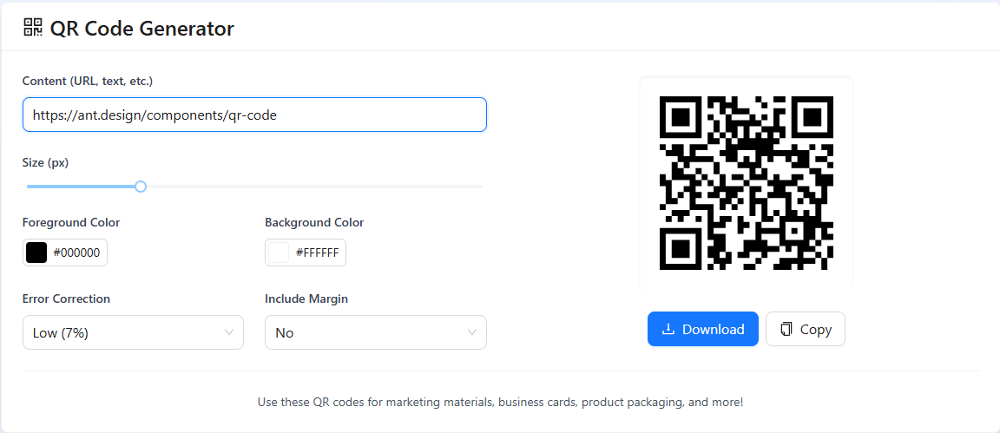

# QRGen - Advanced QR Code Generator

 <!-- Add your screenshot path here -->

QRGen is a modern web application that enables organizations to generate, customize, and manage QR codes with advanced features and analytics.

## Features

- 🚀 **Instant QR Code Generation**
- 🎨 **Full Customization** (colors, size, error correction)
- 📥 **Multiple Download Formats** (PNG, SVG)
- 📊 **Dynamic QR Codes** (update content without changing the code)
- 👥 **Team Collaboration** features
- 📱 **Mobile Responsive** design

## Technologies Used

- **Frontend**: 
  - React.js
  - Ant Design (antd) UI Library
  - Tailwind CSS
- **QR Generation**: 
  - Ant Design QRCode component
- **Additional Libraries**:
  - @ant-design/icons
  - framer-motion (for animations)
  - react-router-dom (for navigation)

## Installation

1. Clone the repository:
   ```bash
   git clone https://github.com/yourusername/qrgen.git
   cd qrgen
   ```

2. Install dependencies:
   ```bash
   npm install
   ```

3. Start the development server:
   ```bash
   npm start
   ```

4. Open your browser and navigate to:
   ```
   http://localhost:3000
   ```

## Usage

1. **Generate QR Codes**:
    - Enter your URL or text in the input field
    - Customize the design (colors, size, etc.)
    - Download in your preferred format (PNG/SVG)

2. **Advanced Features**:
    - Use error correction for better readability
    - Generate dynamic QR codes for changing content
    - Access analytics dashboard (premium feature)

## Project Structure

```
src/
├── components/       # Reusable components
│   ├── Footer.jsx    # Enhanced footer component
│   ├── Header.jsx    # Navigation header
│   └── QRGenerator/  # QR generation components
├── pages/            # Main page components
│   ├── Home.jsx      # Landing page
│   └── Generator.jsx # QR generation page
├── assets/           # Static assets
│   └── logo.svg      # Application logo
├── App.js            # Main application router
└── index.js          # Application entry point
```

## Customization

To customize the application:

1. **Branding**:
    - Replace `src/assets/logo.svg` with your logo
    - Modify colors in `tailwind.config.js`

2. **Features**:
    - Add new QR code options in `QRGenerator.jsx`
    - Extend footer links in `Footer.jsx`

## Deployment

To deploy to production:

1. Build the application:
   ```bash
   npm run build
   ```

2. Deploy the `build` folder to your preferred hosting service:
    - Vercel
    - Netlify
    - AWS Amplify
    - Firebase Hosting

## Contributing

Contributions are welcome! Please follow these steps:

1. Fork the repository
2. Create your feature branch (`git checkout -b feature/AmazingFeature`)
3. Commit your changes (`git commit -m 'Add some AmazingFeature'`)
4. Push to the branch (`git push origin feature/AmazingFeature`)
5. Open a Pull Request

## License

Distributed under the MIT License. See `LICENSE` for more information.

## Contact

For support or inquiries, please contact:

Project Lead: [Your Name]  
Email: your.email@example.com  
Website: https://yourwebsite.com
```

### How to Use This README:

1. Replace placeholder text (like `yourusername`, `your.email@example.com`) with your actual information
2. Add a project screenshot named `demo-screenshot.png` in your root directory
3. Update the features list if you've added or removed any functionality
4. Modify the deployment section based on your hosting preferences

This README provides:
- Clear project description
- Visual demonstration (when you add screenshot)
- Installation and usage instructions
- Technology stack overview
- Project structure explanation
- Contribution guidelines
- Licensing information
- Contact details

The formatting uses standard Markdown for excellent GitHub readability with proper section headers, code blocks, and emoji icons for visual organization.